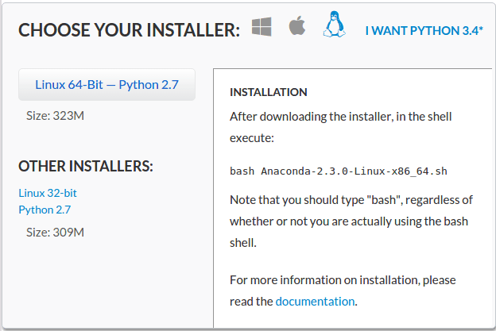

#Jupyter Install

This guide is to help you get Jupyter notebooks up and running on your personal computer.  

##1. Install Anaconda

There are several ways to install Python and Jupyter and all of the required libraries to complete this course.  You are welcome to try out any of them, but we **strongly** suggest using the Anaconda Python Distribution.  It is up-to-date (unlike the versions of Python that may already exist on your Linux or OSX machine) and it also comes with `conda`.  We'll get to `conda` a little later, but believe us, it's awesome and you want to have it.

###Download the installer

First download the Anaconda installer.  Visit http://continuum.io/downloads to download the appropriate installer for your operating system.

**You must first click the link that says "I Want Python 3.4*"** to select the correct installer.

