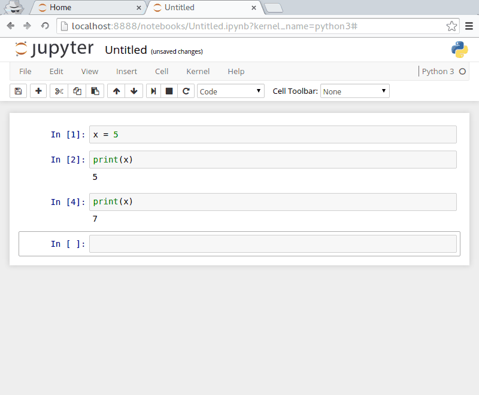

# Intro to Jupyter notebooks

## What is the Jupyter Notebook?
We'll work extensively with [Jupyter Notebooks](https://jupyter-notebook.readthedocs.org/en/latest/notebook.html) (formerly IPython Notebooks) in this course. They are media-rich documents that combine text with markown formatting, typeset mathematics with MathJax, and executable Python statements.

The best way to understand the notebooks is to try them out, so let's get started!

## Launching the notebook server

To launch the notebook server, first open up a terminal and then enter

```Bash
jupyter notebook
```

This will start the notebook server.  It *should* automatically open the main page of the notebook server in your default browser, but if it doesn't, simply open the browser of your choice and enter

```
http://localhost:8888/tree
```

in the address bar.  

This will bring up a simple file-browser that will show the contents of the directory where you've launched the terminal from.  Click on the `New Notebook` button and then select **Python 3** at the bottom to create your first notebook.


##Executing a code cell

Below the toolbars, you'll see a single code cell, prepended with `In [ ]:`.  This cell can contain an arbitrarily long code segment, but we'll start with a simple one liner.  In that lone code cell, type

```Python
x = 5
```

and then hit *Shift+Enter*.  If you just hit Enter you'll find that it will simply add another line to the current cell.  So remember, **to execute a cell**, it's **Shift+Enter**.  

So what happened?  We've assigned the label x to the number 5.  And also you should see that the label of that cell will now read `In[1]:` because that's the first statement we've executed in this Python kernel.  You'll also notice that the notebook has created a new cell, since we already used the only existing cell.  

In this new cell, let's try to print out the value we assigned to x, so enter


```Python
print(x)
```

and then hit **Shift+Enter**.  And there's the output we expect!  The cell gets labeled `In[2]:` and the output of that command is printed immediately below the cell.

The whole procedure should look something like this:


##The Kernel
Don't worry too much about what the "kernel" is, but the main point to remember here is that we can assign a variable in one cell but still access it in a separate cell.  The cells are ways for *us* to divide up our thoughts and our code, but everything is connected underneath.  

##Overwriting variables

Since each cell is interacting with the same Python instance, if we give `x` a new value and then enter `print(x)` we'll get that new value.  That's pretty straight forward —but what if we then delete the cell where we gave `x` a new value?

Let's take a look!


Even though we deleted the cell where we assigned `x = 7`, the assignment is still valid.  In fact, the assignment will remain valid until we explicitly execute a cell that sets x equal to a new value, or until we completely restart this Jupyter Notebook instance.  

##Markdown
Markdown is a *writing format* that makes it easy to type well-formatted text that is rendered into properly formatted XHTML.  It's seriously awesome.  Cells in Jupyter notebooks can be used for many things: to run Python, to embed media, or to write text in Markdown.  This allows us to write notes about what we're doing, what the code is doing, what we're *trying* to do, whatever we like! These notes can be for ourselves, to document our work, or to share with others.

To create a Markdown cell in a notebook, click on an empty cell, then click on the Dropdown list (by default, it will say "Code") and select "Markdown"—as shown below.

Markdown is also (sort of) code, so after you type some text, you will also hit *Shift+Enter* to execute the cell and render the Markdown text.  Try it out!  Just type out a sentence or two in a markdown cell, then hit *Shift+Enter* to render the text. 



##Markdown Math

Markdown can do more than just render simple text, it can also render LaTeX-style equations using **MathJax**!

* For inline math, wrap LaTeX inside single `$` signs
`$...$`
* For single-line rendering, wrap LaTeX inside double `$$` signs
`$$...$$`


**Note:**

Be aware that math typesetting is handled by MathJax and not by LaTeX.  While the vast majority of MathJax syntax is identical to LaTeX, there are a few small differences (especially when it comes to matrix commands).  So if you find something doesn't typeset the way you expect, Google around to make sure you're using the correct command.

##More Markdown Syntax
There are several references to learn Markdown tricks, but we especially like the summary by [John Gruber](http://daringfireball.net/projects/markdown/syntax).  A few features that we find particularly useful are listed below.

For italics, wrap text in single `*`: `*this will be italic*` 
For bold, wrap text in double `**`: `**this will be bold**`
For a bulleted list, start the line with an `*`, then type a space followed by the bullet item
```
* list item
* another list item
* and another
```
